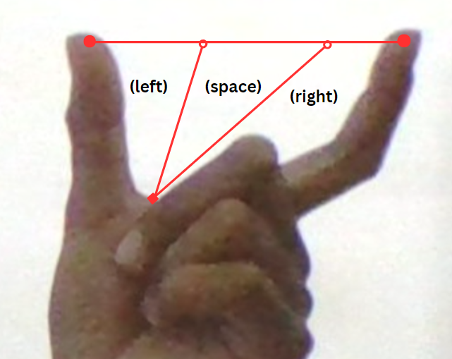

# Hand Gesture Control

This repository contains a Python script for hand gesture control using the Mediapipe library and computer vision techniques. With this script, you can control certain actions on your computer using hand gestures captured through your webcam.

## Features

- Detects hand landmarks using the Mediapipe library.
- Calculates the distance between specific landmarks on the hand.
- Uses the distance to control computer actions based on predefined gestures.
- Supports left and right key presses to simulate keyboard input.
- Provides differezcmnt modes for gesture-based actions.


## Requirements

Before you begin, ensure you have met the following requirements:

- Python 3.x installed on your machine.
- Required libraries: `time`, `copy`, `math`, `argparse`, `cv2`, `mediapipe`, `pyautogui`, `collections`.


## Setup and Usage

1. Clone this repository to your local machine.
2. Install the required libraries using the following command:
   ```bash
   pip install opencv-python mediapipe pyautogui
   ```
3. Run the script using the following command:
   ```bash
   python main.py
   ```
4. A console window will open displaying the gaussian distance.
5. Perform hand gestures within the camera's view to control computer actions.

## Gestures and Actions

 <table style="text-align:left">
      <tr>
         
         <ul>
             <li>Right key: Move index finger away from the thumb</li>
             <li>Left key: Move index finger towards the thumb</li>
         </ul>
      </tr>
 </table>

## Contributing

Contributions are welcome! If you have any improvements or suggestions, feel free to create a pull request.

# Reference

* [MediaPipe](https://mediapipe.dev/)
* [hand-gesture-recognition-mediapipe](https://github.com/kinivi/hand-gesture-recognition-mediapipe)

# Author

- [arpy8](https://github.com/arpy8)